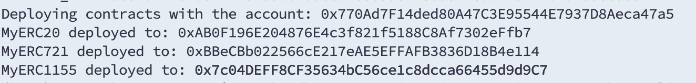
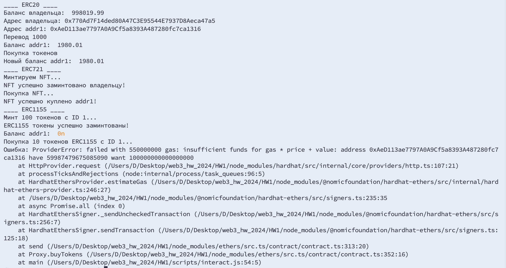
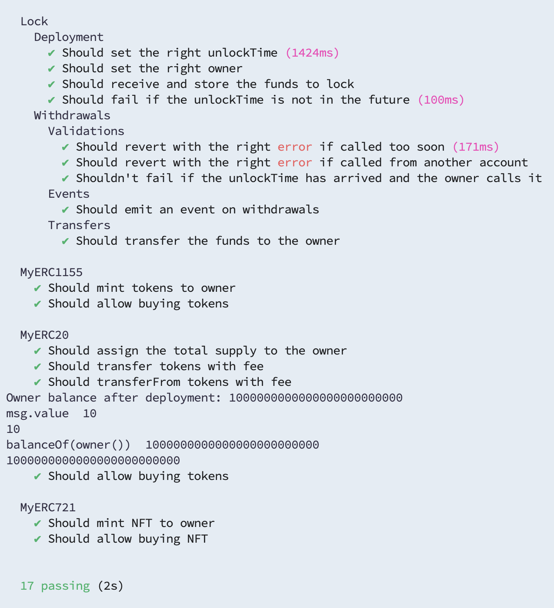
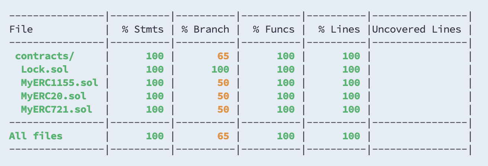

# Домашняя работа номер 1
## Котков Дмитрий Павлович БПИ213

Домашнее задание реализовано проектом, содержащим код 3 СмК контрактов: ERC20, ERC721, ERC1155
Проект содержит несколько папок
- ### contracts
    - содержит реализацию контракта ERC20.
    - содержит реализацию контракта ERC721.
    - содержит реализацию контракта ERC1155.
- ### test
    - содержит тесты для контракта ERC20.
    - содержит тесты для контракта ERC721.
    - содержит тесты для контракта ERC1155.
- ### scripts
    - deploy.js код для деплоя проектов в сеть Alchemy
    - interact.js код для проверки работы проекта
- ### coverage 
    - папка, содержащая отчет о покрытии тестов
- ### и др.папки
- ### и др.папки

#### На следующем рисунке запечатлено разворачивание проекта в тестовой сети sepolia через alchemy.

#### На следующем рисунке показано использование проекта в тестовой сети sepolia через alchemy.

#### На следующем рисунке показан запуск тестирования проекта.

#### На следующем рисунке демонстрируется покрытие тестирования.

## Теоритические вопросы:
1. Что такое функция approve и как она используется? 
    - это функция, которая используется для предоставления разрешения указанному адресу _sender о том, скольким количеством токенов _sender может распоряжаться. Это разрешение также устанавливает лимит токенов для использования.
2. В чем различие ERC721 и ERC1155?
    - между ERC721 и ERC1155 существует масса различий, среди которых:
        - ERC721 поддерживает только создание NFT, в то время как ERC1155 позволяет создавать еще и взаимозаменяемые токены.
        - Повышенная эффективность ERC1155 благодаря использованию пакетных передач: получается снижать нагрузку на сеть и уменьшать расходуемый газ до 90%  
        - ERC1155 имеет функцию безопасности передачи, которая позволяет забрать токены, если они отправлены на неправильный адрес
        - ERC1155 пригоден для работы с децентрализованной биржей, поскольку имеет встроенный код.
3. Что такое SBT токен?
    - это концепция уникальных непередаваемых токенов. С помощью них можно идентифицировать личность человека, поскольку токен не может быть передан на другой адрес.
4. Как можно сделать SBT токен?
    - для создания такого токена отлично подойдет токен ERC721: нужно переопределить все методы передачи токена таким образом, чтобы токен нельзя было передать другим адресам после его создания. 
